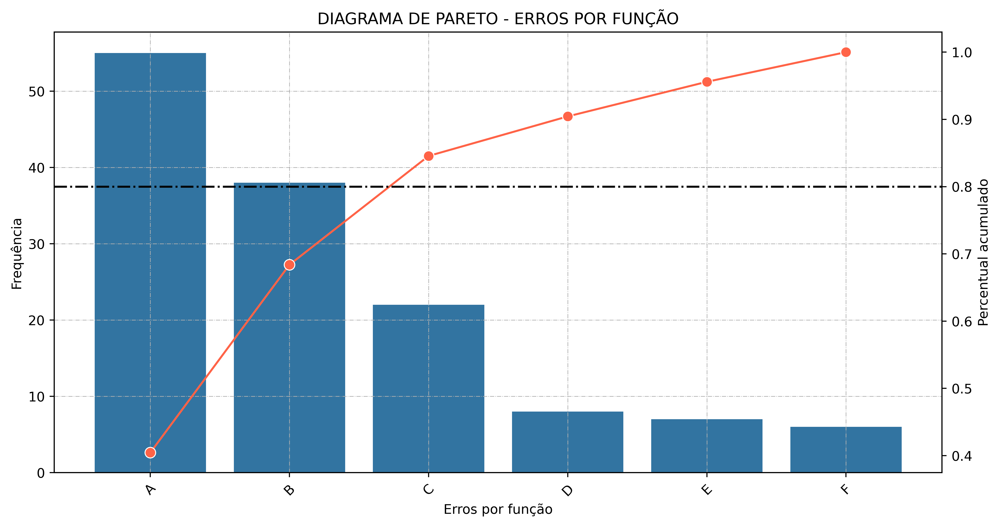

# Diagrama de Pareto em Python

Este projeto oferece uma implementação simples e eficiente do Diagrama de Pareto, uma ferramenta estatística fundamental para análise de dados. Usando a regra 80/20, ele permite identificar quais itens ou fatores são responsáveis pela maior parte dos efeitos observados, ajudando a priorizar ações com base na frequência ou importância.

## O que é um Diagrama de Pareto?

O Diagrama de Pareto é baseado no Princípio de Pareto (regra 80/20) e ajuda a identificar quais fatores são responsáveis pela maior parte dos efeitos observados. É muito útil para:

- **Análise de qualidade**: Identificar defeitos mais frequentes ou falhas de processo.
- **Gestão de problemas**: Priorizar ações para resolver os problemas mais impactantes.
- **Tomada de decisão**: Orientar decisões baseadas em dados sobre onde concentrar esforços.

## Instalação

Clone este repositório e instale as dependências necessárias:

```bash
git clone https://github.com/caioaugustofs/Diagrama_De_Pareto.git

cd Diagrama_De_Pareto

pip install -r requirements.txt
```

## Uso

Abaixo está um exemplo de como utilizar a classe `Pareto` para gerar um diagrama de Pareto:

```python
from pareto import Pareto

itens = ['A', 'B', 'C', 'D']
frequencias = [40, 25, 20, 15]

pareto = Pareto(item=itens, frequencia=frequencias, label='Itens')
pareto.plot(title='Diagrama de Pareto', save=True)
```
A chamada ao método plot irá gerar e exibir o diagrama de Pareto, além de salvar a imagem se o parâmetro save for definido como True.



1. Importe a classe `Pareto` do módulo `pareto`.
2. Defina os itens e suas frequências correspondentes.
3. Crie uma instância da classe `Pareto` passando os itens, frequências e um rótulo opcional.
4. Utilize o método `plot` para gerar e salvar o diagrama de Pareto.


## Detalhes do Código
Classe `Pareto`
A classe `Pareto` é responsável por processar os dados fornecidos e gerar o diagrama de Pareto. Ela é composta pelos seguintes métodos:

- `__init__(self, item, frequencia, label='items')`: Inicializa o objeto com as listas de itens e suas frequências correspondentes. O parâmetro label define o rótulo do eixo x no gráfico.

- `tabela(self)`: Cria um DataFrame do pandas contendo os itens, frequências, percentuais e percentuais acumulados, ordenados pela frequência decrescente.

- `Percentual(self)`: Retorna uma lista com os percentuais individuais de cada item.

- `Percentual_Acumulado(self)`: Retorna uma lista com os percentuais acumulados dos itens.

- `plot(self, title='Diagrama de Pareto', figsize=(12, 6), xlabel=None, hline=False, save=False)`: Gera e exibe o diagrama de Pareto. Possui parâmetros para personalização do gráfico:

    + `title`: Título do gráfico.
    + `figsize`: Tamanho da figura.
    + `xlabel`: Rótulo do eixo x.
    + `hline`: Se verdadeiro, adiciona uma linha horizontal no percentual acumulado de 80%.
    + `save`: Se verdadeiro, salva o gráfico como uma imagem PNG.


## Contribuição

Sinta-se à vontade para contribuir com melhorias e correções

1. Faça um fork deste repositório.
2. Crie uma nova branch para sua feature ou correção de 
3. Faça suas alterações e adicione os commits:
4. Envie suas alterações para o repositório remoto:
5. Abra um Pull Request detalhando suas alterações e aguarde a revisão.

