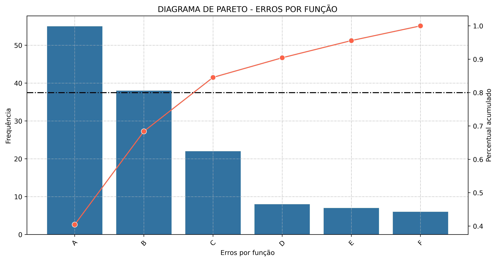

# Diagrama de Pareto em Python

Este projeto fornece uma ferramenta simples e poderosa para gerar **Diagramas de Pareto**. O Diagrama de Pareto é uma técnica que permite identificar as causas mais importantes de um problema, seguindo o princípio de que 80% das consequências advêm de 20% das causas.



## 🚀 Funcionalidades

- **Geração Automática de Tabela**: Cria um DataFrame do Pandas com frequências, percentuais e percentuais acumulados.
- **Visualização Gráfica**: Gera gráficos combinados (barra + linha) usando Seaborn e Matplotlib.
- **Cache de Dados**: Otimizado para evitar cálculos repetidos.
- **Customização**: Permite configurar títulos, rótulos de eixos e salvar a imagem em alta resolução.

## 📦 Instalação

Certifique-se de ter o Python instalado. Clone o repositório e instale as dependências:

```bash
git clone https://github.com/seu-usuario/Diagrama_De_Pareto.git
cd Diagrama_De_Pareto
pip install -r requirements.txt
```

## 🛠️ Como Usar

Aqui está um exemplo rápido de como utilizar a classe `Pareto`:

```python
from pareto import Pareto

# Dados de exemplo
itens = ['A', 'B', 'C', 'D', 'E', 'F']
frequencias = [55, 38, 22, 8, 7, 6]
label = 'Erros por função'

# Inicializa o objeto
prt = Pareto(item=itens, frequencia=frequencias, label=label)

# Obtém a tabela de dados consolidada
tabela = prt.tabela()
print(tabela)

# Gera e salva o gráfico
prt.plot(save=True, title="Análise de Falhas", hline=True)

# Acessa percentuais individualmente se necessário
print(f"Percentuais: {prt.percentual()}")
```

### Argumentos da Classe `Pareto`

| Parâmetro | Tipo | Descrição |
| :--- | :--- | :--- |
| `item` | `list` | Lista de categorias/itens. |
| `frequencia` | `list` | Lista de frequências numéricas correspondentes. |
| `label` | `str` | (Opcional) Nome da coluna de itens. Padrão: `"items"`. |

## 🤝 Contribuindo

Sinta-se à vontade para contribuir! Você pode:
1. Abrir uma **Issue** para relatar bugs.
2. Criar um **Pull Request** com melhorias de código ou novas funcionalidades.

---
Desenvolvido com ❤️ para facilitar a análise de dados.